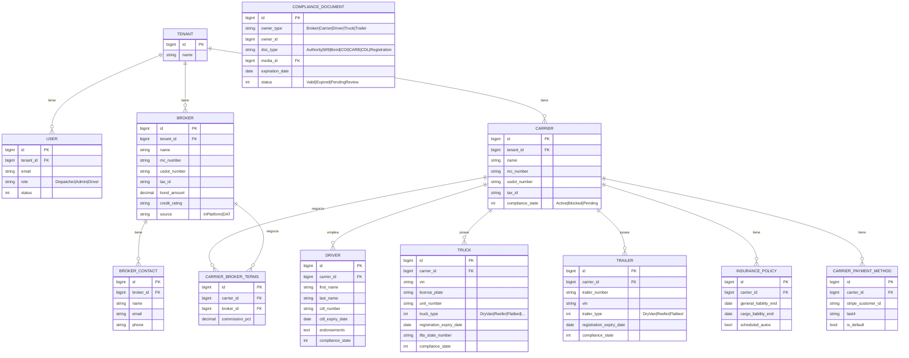
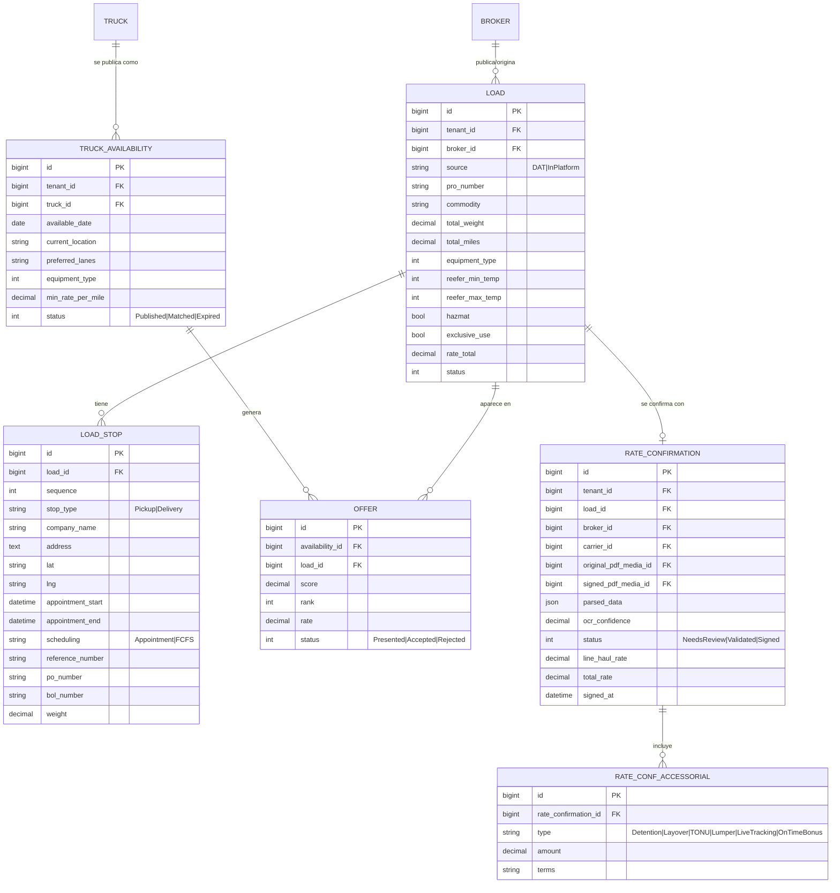
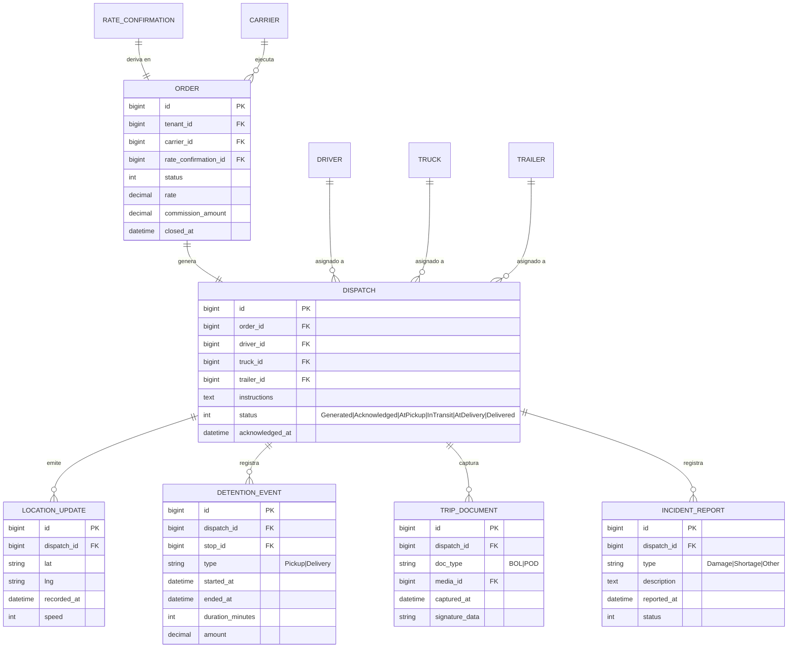
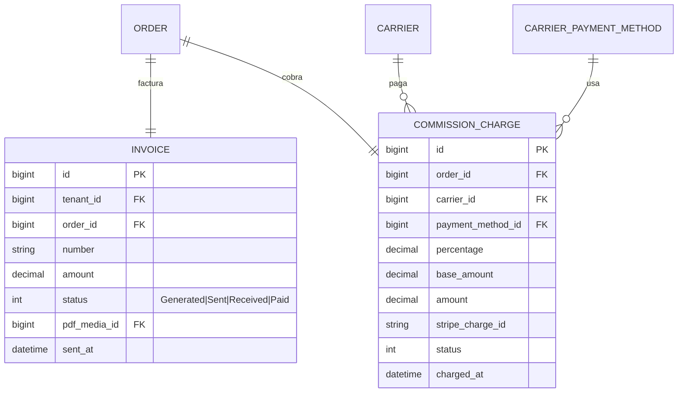

# Truckers Corner — Modelo de Datos Lógico (v0.1)

> Modelo **lógico** (entidades, atributos, relaciones, cardinalidad) con hints ligeros de implementación (PK/FK, índices). Mapea limpio a EF Core / PostgreSQL en la fase física. Notación: **Mermaid ERD (crow's foot)** + diccionario.
>
> Fuentes: checklist del schema heredado + 6 Rate Confirmations reales + PDFs de proceso + decisiones cerradas (dispatcher, single-tenant v1 con scaffolding `TenantId`, DAT API, firma barata).
>
> **Provenance:** 🔵 heredado (keeper) · 🟢 nuevo (rate confs/proceso) · ⚪ estándar/infra

---

## Grupo A — Tenancy, Red & Compliance

> **COMPLIANCE_DOCUMENT es polimórfico** (`owner_type` + `owner_id`) — Mermaid no dibuja FKs polimórficas, por eso aparece suelta. Aplica a las 5 entidades de la red. Generaliza el "paquete de 6 documentos" heredado.

---

## Grupo B — Disponibilidad, Loads, Matching & Booking

---

## Grupo C — Order, Dispatch & Ejecución

---

## Grupo D — Billing

> **MEDIA** (⚪ infra) es referenciada por `media_id` en varias entidades (ComplianceDocument, RateConfirmation, TripDocument, Invoice, User). Tabla compartida: `id, tenant_id, type, file_path, mime, size, uploaded_by`.

---

## Diccionario de datos (detalle por entidad)

### Tenancy & acceso
| Entidad | Atributos clave | Provenance | Notas |
|---|---|---|---|
| **TENANT** | id, name | 🟢 | Scaffolding multi-tenant. v1 = 1 tenant (la operación del dispatcher). |
| **USER** | id, tenant_id, name, email, phone, password_hash, role, status, profile_media_id | 🔵/🟢 | Hereda auth; **rol nuevo** (Dispatcher/Admin/Driver). N:1 con Tenant. |
| **MEDIA** | id, tenant_id, type, file_path, mime, size, uploaded_by | 🔵 | Storage genérico (R2/Blob). |

### Red (Broker / Carrier / Driver / Equipo)
| Entidad | Atributos clave | Provenance | Notas |
|---|---|---|---|
| **BROKER** | id, tenant_id, name, mc_number, usdot_number, tax_id, bond_amount, credit_rating, source | 🟢 | Antes era un string. Ahora entidad con MC/USDOT/Bond/W9. `source` distingue plataforma vs DAT. |
| **BROKER_CONTACT** | id, broker_id, name, email, phone, role | 🟢 | Múltiples contactos/emails por broker (regla del PDF). |
| **CARRIER** | id, tenant_id, name, mc_number, usdot_number, tax_id, address, phone, email, compliance_state | 🔵 | **1 Tenant → N Carriers** (corrige 1:1). Conserva MC/DOT/Tax. |
| **DRIVER** | id, carrier_id, first_name, last_name, address, phone, email, dob, cdl_number, cdl_issued_date, cdl_expiry_date, endorsements, working_days, holidays, compliance_state | 🔵 | **1 Carrier → N Drivers.** Conserva CDL + endorsements. |
| **TRUCK** | id, carrier_id, truck_type, make, model, vin, license_plate, unit_number, weight, length, registration_expiry_date, register_owner, ifta_state_number, compliance_state | 🔵 | **1 Carrier → N Trucks.** Conserva VIN/IFTA/unit#. Enum de tipo ampliado. |
| **TRAILER** | id, carrier_id, trailer_number, vin, trailer_type, registration_expiry_date, length, compliance_state | 🟢 | **Entidad nueva** — el schema viejo no la tenía; las rate confs la referencian aparte. |
| **INSURANCE_POLICY** | id, carrier_id, agent_name/address/phone/email, general_liability_start/end, cargo_liability_start/end, scheduled_autos, scheduled_autos_details | 🔵 | Conserva ventanas de GL y Cargo Liability. |
| **COMPLIANCE_DOCUMENT** | id, owner_type, owner_id, doc_type, media_id, issue_date, expiration_date, status, verified_at | 🔵→🟢 | **Polimórfico.** Generaliza el paquete de 6 docs; habilita monitoreo + auto-bloqueo. |
| **CARRIER_BROKER_TERMS** | id, carrier_id, broker_id, commission_pct | 🟢 | **Comisión variable por par** (reemplaza el 3% fijo). Excepción negociable por load en el RateConfirmation. |
| **CARRIER_PAYMENT_METHOD** | id, carrier_id, stripe_customer_id, type, last4, brand, is_default | 🟢 | Para el cargo de comisión a tarjeta (Stripe). |

### Disponibilidad / Loads / Booking
| Entidad | Atributos clave | Provenance | Notas |
|---|---|---|---|
| **TRUCK_AVAILABILITY** | id, tenant_id, truck_id, driver_id?, available_date, current_location, preferred_lanes, equipment_type, min_rate_per_mile, status | 🟢 | El carrier publica capacidad (dirección correcta del flujo). |
| **LOAD** | id, tenant_id, broker_id, source, pro_number, commodity, total_weight, total_miles, equipment_type, reefer_min_temp, reefer_max_temp, hazmat, exclusive_use, rate_total, status | 🔵→🟢 | Separado del Order. `commodity` (antes "products"). Campos reefer/hazmat/exclusive nuevos. |
| **LOAD_STOP** | id, load_id, sequence, stop_type, company_name, address, lat, lng, appointment_start/end, scheduling, reference_number, po_number, bol_number, weight, contact_name, contact_phone, instructions | 🟢 | **Multi-stop** (N pickups + N deliveries). El viejo solo tenía 1+1. |
| **OFFER** | id, availability_id, load_id, score, rank, rate, status | 🟢 | Resultado del matching (ranking). |
| **RATE_CONFIRMATION** | id, tenant_id, load_id, broker_id, carrier_id, original_pdf_media_id, signed_pdf_media_id, parsed_data(json), ocr_confidence, status, line_haul_rate, total_rate, pro_number, signed_at, signed_by | 🟢 | **Núcleo OCR.** PDF original + firmado + datos extraídos + confidence. Firma barata (canvas+audit / self-hosted). |
| **RATE_CONF_ACCESSORIAL** | id, rate_confirmation_id, type, amount, terms | 🟢 | Detención, layover, TONU, lumper, live-tracking, on-time bonus. |

### Order / Dispatch / Ejecución
| Entidad | Atributos clave | Provenance | Notas |
|---|---|---|---|
| **ORDER** | id, tenant_id, carrier_id, rate_confirmation_id, status, rate, commission_amount, created_at, closed_at | 🟢 | **FK explícita a Carrier** (no transitiva). Entidad operacional. |
| **DISPATCH** | id, order_id, driver_id, truck_id, trailer_id, instructions, status, acknowledged_at | 🟢 | **Asigna driver + truck + trailer.** Acknowledgment obligatorio. |
| **LOCATION_UPDATE** | id, dispatch_id, lat, lng, recorded_at, speed, heading | 🟢 | Tracking; particionar por fecha (crece rápido). |
| **DETENTION_EVENT** | id, dispatch_id, stop_id, type, started_at, ended_at, duration_minutes, rate_per_hour, amount, charge_applied | 🟢 | Detención >2h; alimenta accesoriales/comisión. |
| **TRIP_DOCUMENT** | id, dispatch_id, doc_type, media_id, captured_at, captured_by, signature_data | 🟢 | **BOL** (pickup) y **POD** (delivery) — documentos distintos. |
| **INCIDENT_REPORT** | id, dispatch_id, type, description, media_ids, reported_at, status | 🟢 | Daños/faltantes. |

### Billing
| Entidad | Atributos clave | Provenance | Notas |
|---|---|---|---|
| **INVOICE** | id, tenant_id, order_id, number, amount, status, pdf_media_id, sent_at, received_at | 🔵→🟢 | Invoice al broker con RateConf + POD adjuntos. |
| **COMMISSION_CHARGE** | id, order_id, carrier_id, payment_method_id, percentage, base_amount, amount, stripe_charge_id, status, charged_at | 🟢 | Comisión cobrada al **carrier** vía Stripe. Base = total + accesoriales. |

---

## Notas de diseño

- **Cardinalidad raíz:** `Tenant → Carrier → {Driver, Truck, Trailer}` (todo 1:N). Corrige el 1:1-desde-User del schema heredado. Los varios carriers que coordina el cliente (Nelson, P Munoz, SPH, LRVS) son **N Carriers dentro de 1 Tenant** — no requieren multi-tenant en v1.
- **Cadena contractual→operacional:** `Load → RateConfirmation (1:0..1) → Order (1:1) → Dispatch (1:1)`. Tres entidades separadas (no fusionadas como el viejo `freight_jobs`).
- **Compliance transversal:** `ComplianceDocument` polimórfico + estado `compliance_state` en Broker/Carrier/Driver/Truck/Trailer. Job diario evalúa expiraciones, alerta 10 días antes, y bloquea en cascada (un Driver/Truck Blocked no es asignable a Dispatch).
- **Multi-tenancy (Fase 2):** `TenantId` ya está en todas las entidades de cabecera (scaffolding). La productización (onboarding de tenants, billing por tenant) se agrega después sin refactor.
- **Índices clave (hint físico):** mc_number, usdot_number, vin, license_plate, ifta_state_number, expiration_date (compliance), dispatch_id+recorded_at (tracking), tenant_id (todas).
- **Enums** se modelan como `int` con comentario en este nivel lógico; en EF Core serán enums tipados.

## Alcance v1 vs Fase 2
- **v1:** todas las entidades de los Grupos A–D en single-tenant (1 tenant), con `TenantId` presente.
- **Fase 2:** activar multi-tenant real (gestión de tenants, aislamiento productivo, billing por tenant) y portal de broker self-service.
